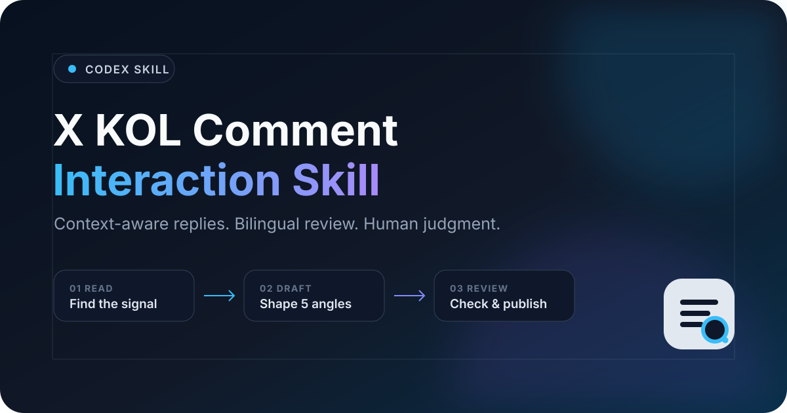
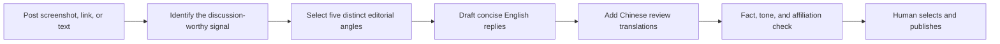

<p align="center">
  
</p>

<p align="center">
  
  
  
</p>

# X KOL Comment Interaction Skill

A reusable Codex skill for drafting concise, context-aware replies to KOL posts on X. It turns a screenshot, link, or pasted post into five distinct English comment options with Chinese translations, clear editorial angles, and fact-safety guardrails.

This repository is designed as both an installable skill and a public product case study—not just a prompt file.

> 中文简介：这是一个面向海外 X 运营场景的 KOL 评论辅助 Skill。输入帖子截图、链接或文字后，它会生成 5 条不同角度的英文评论并附中文翻译。所有内容都应由运营人员审核后手动发布。

## Why it exists

Generic replies such as “Great post” create little value. Strong KOL engagement needs a point of view, context, restraint, and a natural reason for someone to respond. This skill packages that editorial judgment into a repeatable workflow while keeping the operator in control.

## What it delivers

- Five draft directions for human review: recommended, concise, expert, community, and conversation starter.
- English-first copy with short Chinese translations for review.
- Domain-aware angles for AI, technology, crypto, macro markets, and football.
- Careful handling of unverified claims, live data, causal language, and promotional links.
- Human-in-the-loop safeguards: no auto-posting, mass engagement, impersonation, or fabricated facts.

## Workflow



## Example

**Input**

> A post says a voluntary AI safety framework may be adopted by several frontier labs.

**Recommended reply**

> Voluntary standards can look soft on paper, but they often become the rulebook before regulation catches up. The real test is whether this improves safety without locking smaller labs out.

**中文翻译**

> 自愿标准看起来约束力不强，但往往会在正式监管跟上之前成为事实规则。真正的考验是，它能否提升安全性，同时不把小型实验室挡在门外。

See the [demo gallery](docs/demo-gallery.md) for multi-domain examples and the [case study](docs/portfolio-case-study.md) for the product thinking behind the project.

## Repository structure

```text
.
├── assets/                         # Public-facing repository artwork
├── docs/                           # Demo gallery and portfolio case study
└── skills/
    └── write-x-kol-comments/
        ├── SKILL.md                # Core workflow and guardrails
        ├── agents/openai.yaml      # Codex UI metadata
        └── references/             # Angle and example libraries
```

## Install in Codex

For a no-build install, download the packaged skill from the repository's [Releases](https://github.com/Faiz-V/x-kol-comment-interaction-skill/releases) page and unzip it into your Codex skills directory.

Or clone the repository, then copy the skill folder:

```bash
git clone https://github.com/Faiz-V/x-kol-comment-interaction-skill.git
mkdir -p ~/.codex/skills
cp -R x-kol-comment-interaction-skill/skills/write-x-kol-comments ~/.codex/skills/
```

Restart Codex if the skill does not appear immediately. Invoke it explicitly with `$write-x-kol-comments`, or send a post screenshot/text and ask for X comment options.

## Suggested prompts

```text
Use $write-x-kol-comments to draft five replies to this post. Keep them concise and add Chinese translations.
```

```text
Use $write-x-kol-comments. Give me one expert angle, one community angle, and one question-led angle. Do not add facts beyond the source.
```

```text
Use $write-x-kol-comments to add a transparent, non-spammy link to my related analysis. Mention my affiliation where relevant.
```

## Responsible use

This project assists human writing; it does not automate engagement. Review every draft before publishing. Do not use it to impersonate independent users, coordinate deceptive amplification, spam replies, or invent evidence. If you are affiliated with a promoted project or account, disclose that relationship when it is relevant to the audience’s interpretation.

X and Twitter are trademarks of X Corp. This independent project is not affiliated with or endorsed by X Corp.

## Contributing

Contributions that improve clarity, safety, multilingual review, or domain coverage are welcome. Read [CONTRIBUTING.md](CONTRIBUTING.md) before opening a pull request.

See [CHANGELOG.md](CHANGELOG.md) for release notes.

## Version and license status

The current packaged release is [v1.0.0](https://github.com/Faiz-V/x-kol-comment-interaction-skill/releases/tag/v1.0.0). Its ZIP contains the `write-x-kol-comments` skill folder; this is a prompt-and-reference package, not an X API client or an automatic posting service. Model output quality still requires human review.

No repository license has been selected. **Publicly visible / installable does not mean licensed for reuse or redistribution.** The installation instructions describe the package layout; they do not grant a broader license. This documentation update does not add one.
